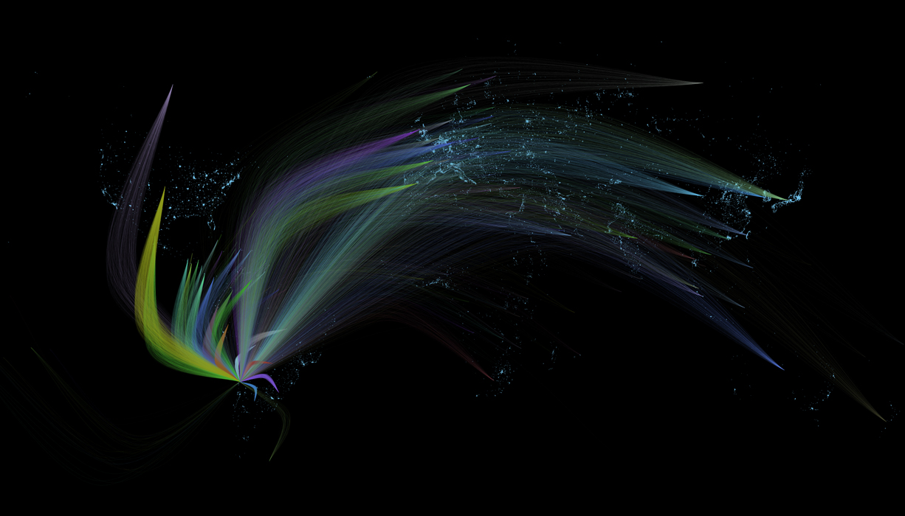

# Visualize International Trade Data.

A Processing application to generate images based on international trade data.

[Chilean Exports during 2015]

[Chilean Imports during 2015]

[America and the Caribbean Exports in 2014]

[America and the Caribbean Exports in 2014]

[America and the Caribbean Imports in 2014]

## Data

- Inter-American Development Bank [Available here.](https://data.iadb.org/)

## License
MIT
